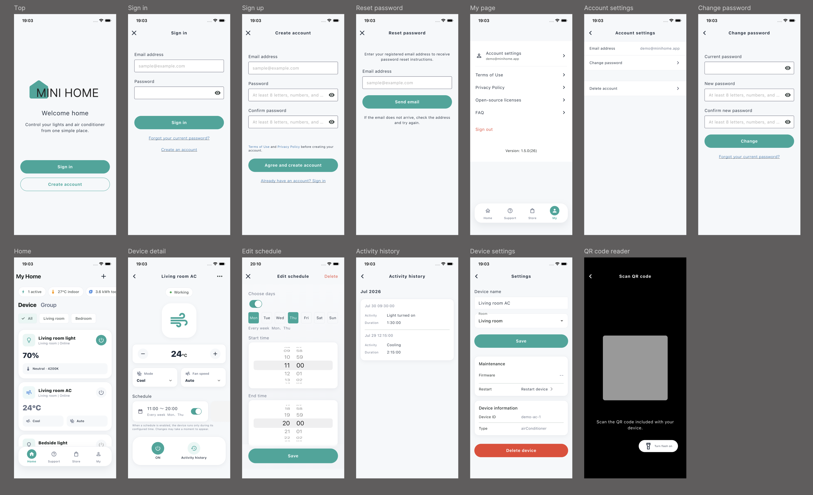
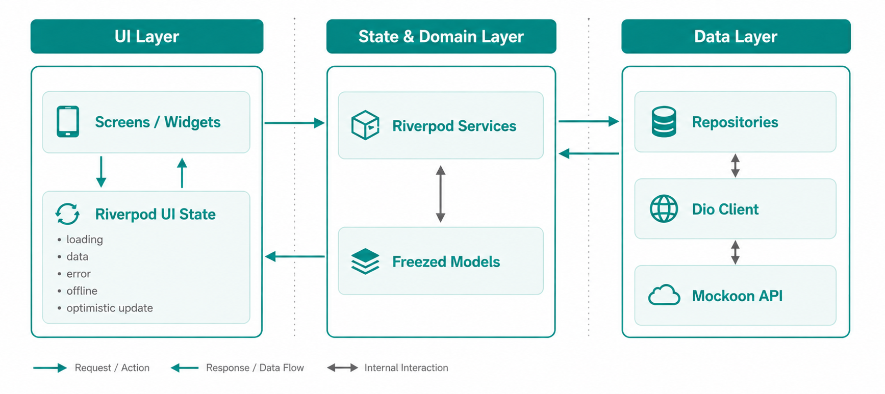

# miniHome

🌐 [English](README.md) | 日本語

<p align="center">
  
</p>

<p align="center"> ライトやエアコンなどのスマートホーム機器を操作する Flutter アプリです。 </p>

<p align="center">  </p>

> クリーンな UI/UX、拡張性を意識したアーキテクチャ、実際のAPI連携を想定した状態管理を中心に、一から設計・実装しています。

## 注力したこと

- **新規アプリとしての設計・実装**: プロダクトテーマ、画面構成、デバイスドメイン、
  UI方針を miniHome 向けに設計しました。
- **技術選定とアーキテクチャ**: 状態管理には Riverpod、immutable なモデルには
  Freezed を採用しました。`models` / `repositories` / `services` を feature 単位で
  まとめ、責務が追いやすい構成にしています。
- **UI/UXと共通コンポーネント**: 明るい背景、読みやすいカード、オンライン/オフライン
  状態、電源操作などを整理し、共通の design token と widget を使って画面の統一感を
  出しました。
- **API駆動の開発**: Mockoon を使い、loading、empty、error、offline、更新系の状態を
  APIレスポンスベースで確認できるようにしました。
- **多言語対応**: 英語を既定言語、日本語を第二言語として、`easy_localization` と
  `AppStrings` 経由で文言を管理しています。
- **QR / カメラ / 権限まわり**: カメラによるQR読み取りや実行時権限など、
  モバイルのネイティブ機能に関わる導線も扱っています。

## 主な機能

- メールアドレス / パスワード認証フロー
- 部屋フィルター付きホームダッシュボード
- ライト・エアコンのデバイスカード
- 一覧からの電源操作
- デバイス種別ごとの詳細画面
- ライトの明るさ・色温度操作
- エアコンの温度・モード・風量操作
- スケジュールの一覧・作成・編集・有効化/無効化・削除
- 利用履歴画面
- 名前、部屋、FW更新、再起動、削除を含むデバイス設定
- QRによるデバイス登録
- 英語既定・日本語対応の localization

## UI design

白基調の背景、角丸カード、わかりやすい状態表示、コンパクトな操作UIを中心に、
モダンなスマートホームアプリらしい見た目を目指しました。

ポートフォリオを見る人が短時間で内容を理解できるようにしつつ、実際のアプリとして
自然に見えることも意識しています。デバイスカードでは重要な情報を先に見せ、詳細画面では
デバイス種別に応じて操作UIを切り替えています。

デザインルールは [docs/minihome-design-system.md](docs/minihome-design-system.md)
にまとめています。

## 使用技術

- Flutter 3.44.0 / Dart 3.12.0
- Riverpod / Hooks
- Freezed / json_serializable
- go_router
- Dio
- Firebase Core / Remote Config
- Mockoon
- easy_localization

Riverpod で画面外に状態と機能ロジックを分離し、Freezed と JSON serialization で
APIモデルの扱いを安定させています。Mockoon を使うことで、実バックエンド接続前でも
現実的なAPIレスポンスを前提に開発できます。

## Architecture

アプリは責務ごとに整理しています。

```text
lib/
├── core/                     # 共通UI、theme、network、constants
├── environment/              # flavor と実行時設定
├── features/
│   └── <feature>/
│       ├── models/           # Freezed models と JSON mapping
│       ├── repositories/     # API / storage access
│       └── services/         # Use case と Riverpod state
├── router/                   # go_router definitions
├── screens/                  # 画面単位のUI
└── utils/                    # 横断的なutility
```

画面から Dio を直接呼ばず、APIアクセスは repository、機能ロジックと状態更新は
service に寄せています。これにより、UIは描画とユーザー操作に集中できます。

<p align="center">
  
</p>

Home と Device Detail では、表示中の画面だけが30秒ごとに軽くデータを更新する
polling を行います。画面が非表示になったり、アプリが非アクティブになった場合は停止し、
バックグラウンド更新中は不要な loading 表示を出さないようにしています。

## 起動方法

ローカル起動には FVM と Mockoon を使います。詳細なセットアップは
[docs/README.ja.md](docs/README.ja.md) にまとめています。

概要としては、`config/app_config.example.json` を元に
`config/app_config.local.json` を作成し、Mockoon を port `3001` で起動してから、
`homeStaging` flavor を `--dart-define-from-file=config/app_config.local.json` 付きで
実行します。

## Demo API

ローカルAPIレスポンスには Mockoon を使用しています。API仕様は
[docs/minihome-api.md](docs/minihome-api.md) にまとめています。

デモデータはすべて架空のものです。実ユーザー、実トークン、実デバイスID、
Firebase設定、署名関連ファイルはコミットしない方針です。

## Documentation

- [開発ドキュメント](docs/README.ja.md)
- [プロダクト仕様と画面遷移](docs/minihome-product-spec.ja.md)
- [Mockoon API contract](docs/minihome-api.md)
- [Design system](docs/minihome-design-system.md)
- [セキュリティと公開リポジトリ運用](docs/security.ja.md)

## Security note

このリポジトリは公開ポートフォリオとして扱う想定です。以下のファイルはコミットしません。

- `config/app_config.local.json`
- `GoogleService-Info*.plist`
- `google-services.json`
- `*.jks` / `*.keystore`
- `*key.properties`
- `ExportOptions*.plist`

詳細は [docs/security.ja.md](docs/security.ja.md) を参照してください。
