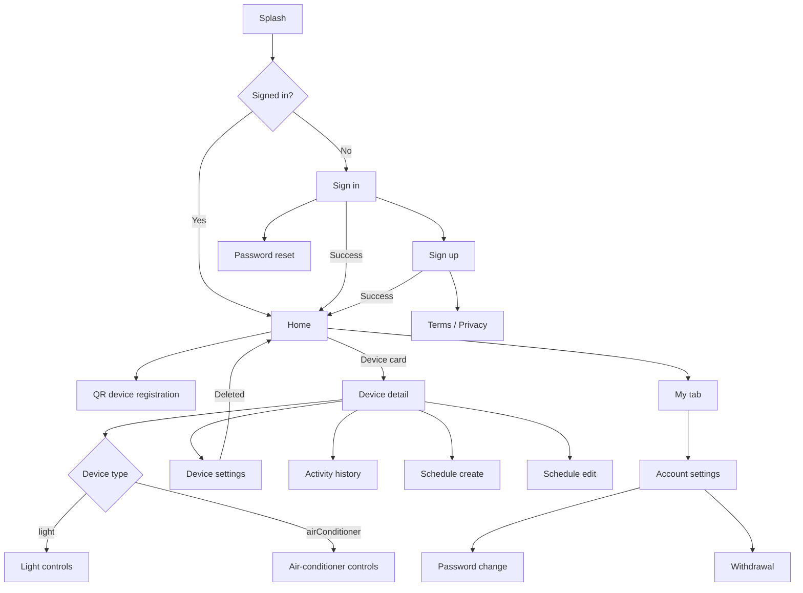

# miniHome プロダクト仕様と画面遷移

🌐 [English](minihome-product-spec.md) | 日本語

## 1. 目的

このドキュメントは、miniHome のプロダクトスコープ、画面、画面遷移、UI方針の
source of truth として扱います。

route 定義の source of truth は `lib/router/router.dart` です。

## 2. プロダクト概要

miniHome は、ライトやエアコンなどのスマートホーム機器を管理する個人向けアプリです。
ポートフォリオ作品として、シンプルで理解しやすいドメインを題材に、実用的な
Flutter アーキテクチャを示すことを目的にしています。

このプロダクトでは、以下が短時間で伝わることを重視します。

- 一貫した design system に基づく polished な Flutter UI
- デバイス種別ごとの操作UI
- Riverpod、Hooks、Freezed、repositories、services の責務分離
- 将来的な Firebase Auth / Firestore 移行を見据えた Mockoon ベースの API 設計
- 公開リポジトリとして安全に扱える secrets 管理

UI は一般的な Smart Life 系アプリの情報設計を参考にしつつ、明るい背景、読みやすい
カード、コンパクトな操作導線を採用します。ただし、特定アプリのコピーではなく、
miniHome として自然に見えるデザインにします。

## 3. 対象デバイス

### Smart light

- 電源 ON / OFF
- 明るさ操作
- 色温度操作
- Online / offline 状態
- 名前と部屋の表示
- 名前と部屋の更新
- スケジュール
- 利用履歴
- Firmware update と reboot のメンテナンス操作

### Air conditioner

- 電源 ON / OFF
- 設定温度操作
- Mode 操作: `auto`, `cooling`, `heating`, `fan`
- Fan speed 操作: `auto`, `low`, `medium`, `high`
- Online / offline 状態
- 名前と部屋の表示
- 名前と部屋の更新
- スケジュール
- 利用履歴
- Firmware update と reboot のメンテナンス操作

## 4. 認証とデータ

現在のスコープ:

- Email / password 認証画面を用意する。
- デモ認証には Mockoon を使う。
- 認証レスポンスの `defaultHomeId` を使う。
- home、room、device、schedule、activity history data は Mockoon から取得する。
- Firebase Core / Remote Config は有効化可能な構成にする。

今後の拡張:

- Firebase Auth
- Firestore-backed な home / device data
- Google / Apple などの外部IDログイン
- 複数ユーザーでの home sharing

## 5. 登録とメンテナンス

アプリは QR / カメラによる device registration をサポートします。
再起動などの device maintenance action は、現在の MVP では Mockoon API 経由で扱います。

本番 IoT provisioning は現在のポートフォリオスコープ外です。

## 6. データモデル方針

`Device.type` によって device-specific UI を切り替えます。

```dart
enum DeviceType {
  @JsonValue('light')
  light,
  @JsonValue('airConditioner')
  airConditioner,
}
```

共通フィールド:

| Field | Type | Purpose |
| --- | --- | --- |
| `id` | `int` | Routing と API update |
| `externalDeviceId` | `String` | Demo identifier と maintenance flow |
| `homeId` | `int` | 親 home |
| `roomId` | `int` | Room filtering |
| `name` | `String?` | 表示名 |
| `type` | `DeviceType` | UI と action の分岐 |
| `isOnline` | `bool` | 操作可否 |
| `isPowerOn` | `bool` | 電源状態 |
| `lightState` | `LightState?` | Light-specific values |
| `airConditionerState` | `AirConditionerState?` | AC-specific values |
| `fwVersion` | `String?` | Maintenance display |
| `lastPingedAt` | `DateTime?` | Connectivity display |

UI は type-specific state を読む前に、必ず `type` で分岐します。

## 7. 画面一覧

| Screen | Path | Main role |
| --- | --- | --- |
| Splash | `/splash` | 初期化と認証状態確認 |
| Home | `/` | Dashboard、room filter、device list、bottom tabs |
| Sign in | `/sign-in` | Email / password sign in |
| Sign up | `/sign-up` | Demo account creation |
| Password reset | `/password-reset` | Reset email flow |
| Password change | `/password-change` | ログイン後の password update |
| Account settings | `/account-settings` | Email、password、withdrawal |
| Withdrawal | `/withdrawal` | Account deletion confirmation |
| Web view | `/web-view` | Terms、privacy、FAQ の local content |
| Device registration | `/device-registration` | QR / camera registration |
| Device detail | `/device-detail/:deviceId` | Type-specific controls |
| Device settings | `/device-detail/:deviceId/settings` | Metadata and maintenance |
| Activity history | `/device-detail/:deviceId/usages` | Device activity history |
| Schedule create | `/schedule/create/:deviceId` | Create schedule |
| Schedule edit | `/schedule/edit/:deviceId` | Edit / delete schedule |

## 8. Navigation



## 9. UI rules

Home:

- app bar に home name を表示する。
- 右上には plain な `+` action を表示する。
- bottom bar は `Home`, `Support`, `Store`, `My` を維持する。
- `My` tab から settings content を表示する。
- 未対応 tab は visual placeholder として扱う。
- room filters は device list の上部付近に表示する。
- list-level power control は有効のままにする。
- device card には `MiniHomeDeviceCard` を使う。

Device detail:

- shared app bar component を使う。
- app bar は scroll 時に floating させない。
- hero device icon と status pill を表示する。
- online かつ power on の device は `Working` と表示する。
- offline 時は操作を disabled にし、offline explanation を表示する。
- 操作 card には shared surface / card primitive を使う。
- bottom floating area には power と activity-history action のみを置く。
- schedule は bottom action bar ではなく schedule section 内に置く。

Settings:

- shared app bar と button widgets を使う。
- firmware update と reboot は generic maintenance action として残す。
- delete API を呼び、成功後は Home に戻る。

## 10. Localization

- English を既定言語にする。
- Japanese を第二言語にする。
- すべての user-facing string は `AppStrings` を経由する。
- `en.json` と `ja.json` の key を一致させる。
- translation key と文言は smart-home domain に合わせる。

## 11. Out of scope

- Firestore persistence
- Firebase Auth
- External ID login
- Home sharing
- Advanced scenes or automations
- Push notifications
- Production IoT provisioning
- Analytics dashboards

## 12. Completion checklist

- brand / domain term scan で不要な product-facing result が残っていない。
- `config/app_config.local.json` が ignore されている。
- Mockoon fixtures が架空データのみで構成されている。
- `jq empty assets/translations/en.json assets/translations/ja.json` が通る。
- 変更した Dart files が format されている。
- `fvm flutter analyze` に error がない。
- README と docs が公開ポートフォリオリポジトリとして適切な状態になっている。
