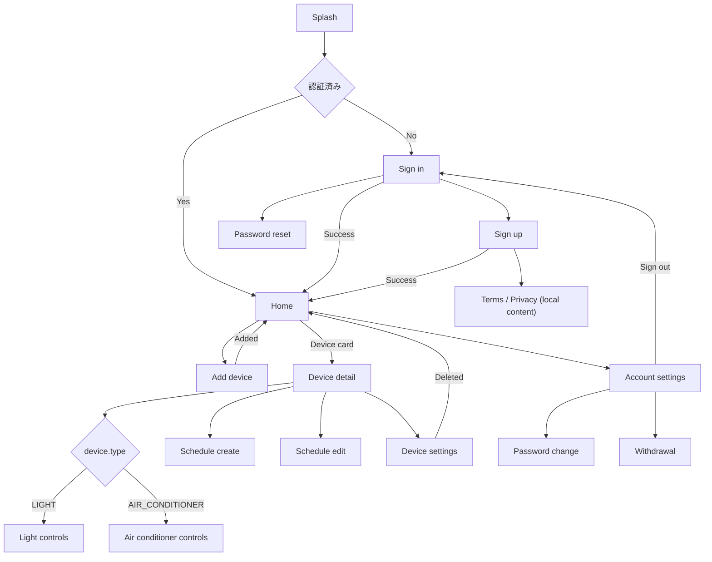

# miniHome プロダクト仕様・画面遷移

## 1. この文書の位置づけ

この文書は、miniHome MVPの画面、遷移、機能スコープ、UI方針の source of truth とする。
現在の実装を一度に作り直さず、既存の画面数と遷移を活用しながらEV充電器管理から
ライト／エアコン管理へ段階移行する。

実装と食い違う場合は `lib/router/router.dart` を現在地として確認し、この文書の
「目標仕様」との差分を小さな単位で解消する。

## 2. プロダクト概要

miniHomeは、自宅のスマートライトとエアコンを一覧し、状態確認と基本操作ができる
個人向けIoT管理アプリである。

ポートフォリオでは次の点が短時間で伝わることを重視する。

- Flutterによる実用的で統一されたモバイルUI
- デバイス種別に応じた表示と操作の切り替え
- Riverpod、Hooks、Freezed、repository層による責務分割
- MockoonからFirebase Auth／Firestoreへ段階移行できる構成

Smart Life系アプリの「明るい背景、状態が読みやすいカード、少ない操作手順」という
情報設計を参考にする。ただし、配色、アイコン、レイアウト、文言はminiHome独自とし、
特定サービスの画面を複製しない。

## 3. 現在の実装調査

### 3.1 ルーター

`lib/router/router.dart` には現在15ルートが登録されている。

| # | ルート名 | パス | 現在の役割 | miniHomeでの扱い |
| ---: | --- | --- | --- | --- |
| 1 | `splashScreen` | `/splash` | 初期化、更新確認 | 維持・ブランド変更 |
| 2 | `homeScreen` | `/` | 未認証時の案内／充電器一覧 | デバイスホームへ置換 |
| 3 | `signUpScreen` | `/sign-up` | アカウント作成 | 維持・デザイン変更 |
| 4 | `signInScreen` | `/sign-in` | サインイン | 維持・デザイン変更 |
| 5 | `passwordResetScreen` | `/password-reset` | 再設定メール送信 | 維持・デザイン変更 |
| 6 | `passwordChangeScreen` | `/password-change` | ログイン中のパスワード変更 | 維持 |
| 7 | `webViewScreen` | `/web-view` | 規約、プライバシー、FAQ | 維持 |
| 8 | `accountSettingsScreen` | `/account-settings` | メール、パスワード、退会 | 簡略化して維持 |
| 9 | `withdrawalScreen` | `/withdrawal` | 退会確認 | 維持 |
| 10 | `deviceRegistrationScreen` | `/device-registration` | QRによる充電器登録 | デモデバイス追加へ置換 |
| 11 | `deviceDetailScreen` | `/device-detail/:deviceId` | 充電状態、履歴、予定 | 種別別の操作画面へ置換 |
| 12 | `deviceSettingScreen` | `/device-detail/:deviceId/settings` | 名称、FW、再起動 | 名称、部屋、削除へ整理 |
| 13 | `usagesScreen` | `/device-detail/:deviceId/usages` | 充電履歴 | MVPではルート削除候補 |
| 14 | `scheduleCreateScreen` | `/schedule/create/:deviceId` | 予定作成 | 汎用スケジュールへ変更 |
| 15 | `scheduleEditScreen` | `/schedule/edit/:deviceId` | 予定編集、削除 | 汎用スケジュールへ変更 |

補足:

- 初期ロケーションは `/splash`。
- `chargingHistoryScreen` はルート名定数のみ存在し、ルート登録されていない。
- デバイス詳細配下に設定と利用履歴がネストされている。
- スケジュール編集は `state.extra` で `Schedule` を受け取る。
- デバイス追加は現在 `AuthState` を `state.extra` で受け取り、カメラ／QRを利用する。

### 3.2 現在の画面責務

| 領域 | 現在の主な責務 | 移行時の注意 |
| --- | --- | --- |
| Splash | Firebase初期化後の更新確認、Home遷移 | ロゴと背景をminiHome化する |
| Home | 認証状態によるWelcome／デバイス一覧切替、Drawer表示 | 部屋フィルターと2列カードへ変更する |
| Device detail | 30秒ポーリング、充電状態、使用履歴、FW、スケジュール | 汎用取得処理を残しEV表示を種別別パネルへ置換する |
| Device settings | 名称変更、FW情報、再起動 | FW／再起動を外し、部屋変更／削除へ変更する |
| Device registration | カメラ権限、QR読取、登録API | MVPはライト／エアコンを選ぶデモ追加に簡略化する |
| Schedule | 作成、編集、有効化、削除 | デバイス種別別の実行内容を扱える形にする |
| Account | メール表示、パスワード変更、退会、サインアウト導線 | 公開デモとして必要な項目だけ残す |

## 4. MVPの機能スコープ

### 4.1 対象デバイス

#### スマートライト

- 電源のオン／オフ
- 明るさの変更（0〜100%）
- 色温度の変更（暖色〜白色）
- 名前、設置部屋、オンライン状態の表示
- 名前と設置部屋の変更
- スケジュールの表示、作成、編集、有効化、削除

#### エアコン

- 電源のオン／オフ
- 設定温度の変更
- 運転モードの変更（自動、冷房、暖房、送風）
- 風量の変更（自動、弱、中、強）
- 名前、設置部屋、オンライン状態の表示
- 名前と設置部屋の変更
- スケジュールの表示、作成、編集、有効化、削除

### 4.2 共通機能

- サインアップ、サインイン、サインアウト
- パスワード再設定と変更
- ホーム名と部屋フィルターの表示
- デバイス一覧、電源状態、オンライン状態の表示
- 一覧カードからの電源切り替え
- デモデバイス追加
- アカウント設定
- ローディング、空状態、通信エラー、オフライン状態の表示

### 4.3 MVPで扱わないもの

- 実機とのBLE／Wi-Fi接続、QRプロビジョニング
- Firebase Authenticationへの移行
- Google、Apple、OIDCなどの外部IDログイン
- Firestore同期
- 複数ユーザーによるホーム共有
- 消費電力履歴と分析グラフ
- シーン、自動化、位置情報連携
- ファームウェア更新、デバイス再起動
- プッシュ通知

## 5. デバイス種別と表示制御

### 5.1 モデル方針

既存の `Device` に必須の `type` を追加し、製品型番を表す既存 `DeviceModel` とは
別の責務として扱う。miniHome移行完了後、EV固有の `DeviceModel` は削除する。

```dart
enum DeviceType {
  @JsonValue('LIGHT')
  light,
  @JsonValue('AIR_CONDITIONER')
  airConditioner,
}
```

想定する共通フィールド:

| フィールド | 型 | 用途 |
| --- | --- | --- |
| `id` | `int` | 画面遷移、API更新 |
| `externalDeviceId` | `String` | デモ上の識別子 |
| `type` | `DeviceType` | UIと操作内容の分岐 |
| `nickname` | `String` | 表示名 |
| `roomId` | `int` | 部屋フィルター |
| `isOn` | `bool` | 電源状態 |
| `isOnline` | `bool` | 操作可否と状態表示 |

種別固有フィールドは段階移行では `Device` にnullableで追加してよい。ただし、UIで
存在を推測せず、必ず `type` を先に判定する。

- `light`: `brightness`, `colorTemperature`
- `airConditioner`: `targetTemperature`, `operationMode`, `fanSpeed`

### 5.2 UI分岐

詳細画面のルートは共通の `/device-detail/:deviceId` を維持する。取得した
`device.type` に応じて本文コンポーネントを切り替える。

```text
DeviceDetailScreen
├── DeviceType.light          → LightControlPanel
└── DeviceType.airConditioner → AirConditionerControlPanel
```

一覧カードも共通の枠を使い、アイコン、状態文言、補助情報のみを種別で切り替える。
未知のtypeをライト等へフォールバックさせず、「未対応のデバイス」として操作不可表示にする。

### 5.3 表示ルール

| 状態 | カード | 詳細画面 |
| --- | --- | --- |
| オンライン／ON | 種別アイコン、ON状態、アクセント付き電源ボタン | 全操作を有効化 |
| オンライン／OFF | 低彩度カード、OFF状態 | 電源操作を主表示、詳細操作は非活性または低強調 |
| オフライン | オフラインラベル、カード全体を低彩度化 | 全操作を無効化し理由を表示 |
| 未対応type | 汎用アイコン、未対応ラベル | 設定参照以外を無効化 |

## 6. 目標画面一覧

MVPは現在の構造を活用した14ルートを基本とし、利用履歴画面を外す。
ライト用／エアコン用に別ルートは作らない。

| 画面 | 主な表示／操作 | 完了条件 |
| --- | --- | --- |
| Splash | miniHomeロゴ、初期化 | 認証状態に応じてHomeまたはSign inへ進む |
| Sign in | メール、パスワード、再設定、登録導線 | Mockoon認証でHomeへ進める |
| Sign up | メール、パスワード、規約導線 | 登録成功後にHomeへ進める |
| Password reset | メール送信 | 成功／失敗を明示する |
| Password change | 現在／新パスワード | 更新結果を明示する |
| Home | ホーム名、部屋、2列デバイスカード、追加 | 絞り込み、電源操作、詳細遷移ができる |
| Add device | ライト／エアコン選択、名前、部屋 | デモデバイスを追加してHomeへ戻る |
| Device detail | 共通ヘッダー、種別別操作、予定、設定 | `type` に応じた操作パネルを表示する |
| Device settings | 名前、部屋、デバイス情報、削除 | 更新／削除結果を反映する |
| Schedule create | 曜日、時刻、実行内容 | 種別に合う予定を保存する |
| Schedule edit | 予定編集、有効化、削除 | 一覧へ反映する |
| Account settings | メール、パスワード変更、退会、サインアウト | 認証関連導線が動作する |
| Withdrawal | 注意事項、退会確認 | 完了後Sign inへ戻る |
| Legal / Help | 規約、プライバシー、FAQ | 外部リンクなしでローカル本文を表示する |

## 7. 目標画面遷移



遷移ルール:

- 認証成功、サインアウト、退会完了は履歴を残さない `goNamed` を使う。
- 詳細、設定、スケジュール、規約は戻ることを前提に `pushNamed` を使う。
- デバイス追加成功後は追加画面を閉じ、Home側で一覧を再取得する。
- デバイス削除後は詳細画面を履歴に残さずHomeへ戻す。

## 8. Home画面仕様

- 背景は白〜ごく薄いニュートラルグレーとする。
- 上部にホーム名、右上にプロフィール／設定アイコンを置く。
- 「すべて」「リビング」「寝室」などの部屋を横スクロールのチップで表示する。
- デバイスは余白の広い2列カードで表示する。
- カード全体のタップで詳細、電源ボタンのタップで即時切り替えを行う。
- ライトは明るさ、エアコンは設定温度とモードを補助情報として表示する。
- オフライン端末は操作不可とし、色だけでなくラベルでも状態を示す。
- デバイスがない場合は短い説明と「デバイスを追加」ボタンを表示する。
- Floating Action Buttonまたは右上の追加ボタンは全画面で一貫した位置にする。

## 8.1 言語とローカルコンテンツ

- アプリの既定言語は英語とする。
- 日本語は第二言語として翻訳資産を維持する。
- 新しい表示文言は英語と日本語を同じ変更内で追加する。
- 利用規約、プライバシーポリシー、FAQはポートフォリオ用のサンプル本文をアプリ内に保持する。
- 規約類の画面は外部URLやネットワーク接続を必要としない。
- サンプル本文であり実サービス向けの法的文書ではないことを明記する。

## 9. デザイン方針

### 9.1 ビジュアル

- 白基調で、背景とカードの境界は薄いグレー、控えめな影、角丸で表現する。
- アクセントカラーはminiHome独自の青緑系を基本候補とする。
- ON状態はアクセントカラー、OFF／オフラインはニュートラルカラーで表現する。
- ライトは暖色の補助色、エアコンは涼しさを示す青系の補助色を使用できる。
- 装飾よりも状態、デバイス名、主要操作の読みやすさを優先する。
- アイコンの線幅、角丸、サイズを揃え、写真素材には依存しない。

### 9.2 レイアウトと操作

- 基本余白は8pxグリッドを使い、画面左右は16〜20pxを基準とする。
- カード、操作パネル、ダイアログの角丸を共通トークン化する。
- タップ領域は44px以上を確保する。
- 電源など頻度の高い操作は片手で届きやすい位置に置く。
- 色だけに依存せず、アイコン、文言、スイッチ状態を併用する。
- 操作中はローディング、成功、失敗を明示し、楽観更新する場合は失敗時に戻す。

### 9.3 共通コンポーネント候補

- `MiniHomeScaffold`
- `HomeHeader`
- `RoomFilterChips`
- `DeviceCard`
- `DevicePowerButton`
- `DeviceStatusBadge`
- `ControlPanel`
- `SettingListTile`
- `EmptyState`
- `ErrorState`

正確な色、文字サイズ、角丸、影はブランド／デザインシステム実装時に
`docs/minihome-design-system.md` とThemeへ確定する。

## 10. データ提供方針

MVPではMockoonをAPIサーバーとして利用する。

- 既存のDioクライアント、repository、service構造を維持する。
- UIからMockoonやDioを直接参照しない。
- デバイスAPIレスポンスに `type` を必須で追加する。
- 一覧と詳細でtype表現を統一する。
- ライトとエアコンを最低1台ずつ返す正常系レスポンスを用意する。
- オフライン、空一覧、APIエラーのデモ用レスポンスも用意する。
- 将来はrepository実装を差し替えてFirestoreへ移行する。

## 11. 段階移行順序

1. `DeviceType` と新しい共通フィールドを追加し、Mockoonレスポンスを整合させる。
2. Homeを白基調の部屋フィルター＋2列デバイスカードへ変更する。
3. Device detailを共通枠＋種別別操作パネルへ変更する。
4. Device settingsからEV／FW固有機能を除き、名前／部屋／削除へ変更する。
5. Device registrationをQR読取からデモデバイス追加へ変更する。
6. Scheduleをライト／エアコン共通モデルへ変更する。
7. Usagesルートと残ったEV固有モデル／文言／アセットを削除する。
8. 認証画面とアカウント画面を新しいデザインシステムへ統一する。

移行ルール:

- 1回の変更は1画面または1ドメイン境界を基本とする。
- 新しいminiHome実装が動作してから対応するEV固有コードを削除する。
- API変更時はモデル、repository、service、Mockoonを同時に整合させる。
- `.g.dart` と `.freezed.dart` は手編集しない。
- 各段階でformat、code generation、analyzeを行い、起動可能な状態を維持する。

## 12. 開発・ビルド環境

- Flutter 3.44.0をFVMで管理する。
- Xcode 26.3でiOS Simulator buildが成功する状態を維持する。
- iOS Deployment Targetは15.5以上とする。
- Firebase関連の秘密値はローカル設定から注入し、Gitへ含めない。
