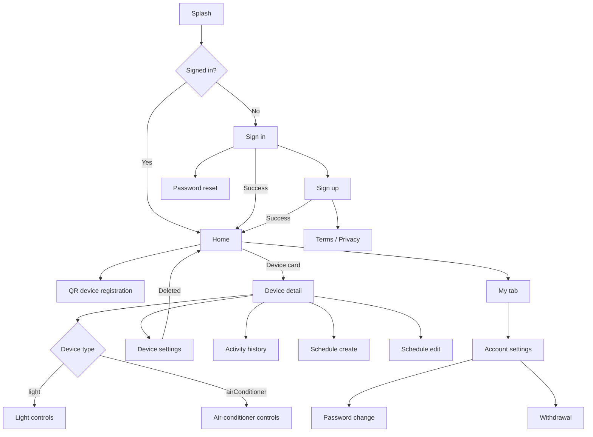

# miniHome product specification and navigation

## 1. Purpose

This document is the source of truth for the miniHome product scope, screens,
navigation, and UI direction.

`lib/router/router.dart` is the source of truth for route definitions.

## 2. Product overview

miniHome is a personal smart-home app for managing connected home devices, such
as lights and air conditioners.
It is built as a portfolio project that demonstrates practical Flutter
architecture with a simplified, easy-to-understand domain.

The product should communicate the following quickly:

- polished Flutter UI with a consistent design system;
- type-specific device controls;
- Riverpod, Hooks, Freezed, repositories, and services used with clear
  responsibilities;
- a Mockoon-backed API designed so Firebase Auth / Firestore can be added later;
- public-repository hygiene with local-only secrets.

The UI takes inspiration from common Smart Life-style information architecture:
bright backgrounds, readable cards, compact controls, and short user paths. The
visual system should feel like miniHome, not a copy of another app.

## 3. Device scope

### Smart light

- Power on/off.
- Brightness control.
- Color-temperature control.
- Online/offline state.
- Name and room display.
- Name and room updates.
- Schedules.
- Activity history.
- Firmware update and reboot maintenance actions.

### Air conditioner

- Power on/off.
- Target temperature control.
- Mode control: `auto`, `cooling`, `heating`, `fan`.
- Fan speed control: `auto`, `low`, `medium`, `high`.
- Online/offline state.
- Name and room display.
- Name and room updates.
- Schedules.
- Activity history.
- Firmware update and reboot maintenance actions.

## 4. Authentication and data

Current scope:

- support email/password authentication screens;
- use Mockoon for demo authentication;
- use `defaultHomeId` from the auth response;
- use Mockoon for home, room, device, schedule, and activity-history data;
- use Firebase Core / Remote Config for app configuration when enabled.

Future work:

- Firebase Auth;
- Firestore-backed home/device data;
- external identity providers such as Google or Apple;
- multi-user home sharing.

## 5. Registration and maintenance

The app supports QR/camera registration. Bluetooth is used by device
maintenance actions such as reboot-related communication.

Production IoT provisioning is outside the current portfolio scope.

## 6. Data model rules

`Device.type` controls device-specific UI.

```dart
enum DeviceType {
  @JsonValue('light')
  light,
  @JsonValue('airConditioner')
  airConditioner,
}
```

Common fields:

| Field | Type | Purpose |
| --- | --- | --- |
| `id` | `int` | Routing and API updates |
| `externalDeviceId` | `String` | Demo identifier and maintenance flow |
| `homeId` | `int` | Parent home |
| `roomId` | `int` | Room filtering |
| `name` | `String?` | Display name |
| `type` | `DeviceType` | UI and action branching |
| `isOnline` | `bool` | Operation availability |
| `isPowerOn` | `bool` | Power state |
| `lightState` | `LightState?` | Light-specific values |
| `airConditionerState` | `AirConditionerState?` | AC-specific values |
| `fwVersion` | `String?` | Maintenance display |
| `lastPingedAt` | `DateTime?` | Connectivity display |

The UI must branch by `type` before reading type-specific state.

## 7. Screens

| Screen | Path | Main role |
| --- | --- | --- |
| Splash | `/splash` | Initialization and auth check |
| Home | `/` | Dashboard, room filter, device list, bottom tabs |
| Sign in | `/sign-in` | Email/password sign in |
| Sign up | `/sign-up` | Demo account creation |
| Password reset | `/password-reset` | Reset email flow |
| Password change | `/password-change` | Logged-in password update |
| Account settings | `/account-settings` | Email, password, withdrawal |
| Withdrawal | `/withdrawal` | Account deletion confirmation |
| Web view | `/web-view` | Local terms, privacy, FAQ content |
| Device registration | `/device-registration` | QR/camera registration |
| Device detail | `/device-detail/:deviceId` | Type-specific controls |
| Device settings | `/device-detail/:deviceId/settings` | Metadata and maintenance |
| Activity history | `/device-detail/:deviceId/usages` | Device activity history |
| Schedule create | `/schedule/create/:deviceId` | Create schedule |
| Schedule edit | `/schedule/edit/:deviceId` | Edit/delete schedule |

## 8. Navigation



## 9. UI rules

Home:

- show the home name in the app bar;
- show a plain `+` action in the top-right corner;
- keep the bottom bar: `Home`, `Support`, `Store`, `My`;
- show settings content from the `My` tab;
- keep unsupported tabs as visual placeholders;
- show room filters near the top of the device list;
- keep list-level power control enabled;
- use `MiniHomeDeviceCard` for device cards.

Device detail:

- use the shared app bar component;
- keep the app bar non-floating during scroll;
- show a hero device icon and status pill;
- show `Working` when an online device is powered on;
- show disabled controls with an offline explanation when offline;
- use shared surface/card primitives for control cards;
- keep only the power and activity-history actions in the bottom floating area;
- keep schedules inside the schedule section, not in the bottom action bar.

Settings:

- use shared app bar and button widgets;
- keep firmware update and reboot as generic maintenance actions;
- use the delete API and return to Home after success.

## 10. Localization

- English is the default language.
- Japanese is the secondary language.
- Every user-facing string must go through `AppStrings`.
- `en.json` and `ja.json` must have matching keys.
- Keep translation keys and copy aligned with the smart-home domain.

## 11. Out of scope

- Firestore persistence.
- Firebase Auth.
- External ID login.
- Home sharing.
- Advanced scenes or automations.
- Push notifications.
- Production IoT provisioning.
- Analytics dashboards.

## 12. Completion checklist

- A brand/domain term scan returns no unrelated product-facing results.
- `config/app_config.local.json` remains ignored.
- Mockoon fixtures contain only fictional data.
- `jq empty assets/translations/en.json assets/translations/ja.json` passes.
- Changed Dart files are formatted.
- `fvm flutter analyze` has no errors.
- README and docs are suitable for a public portfolio repository.
